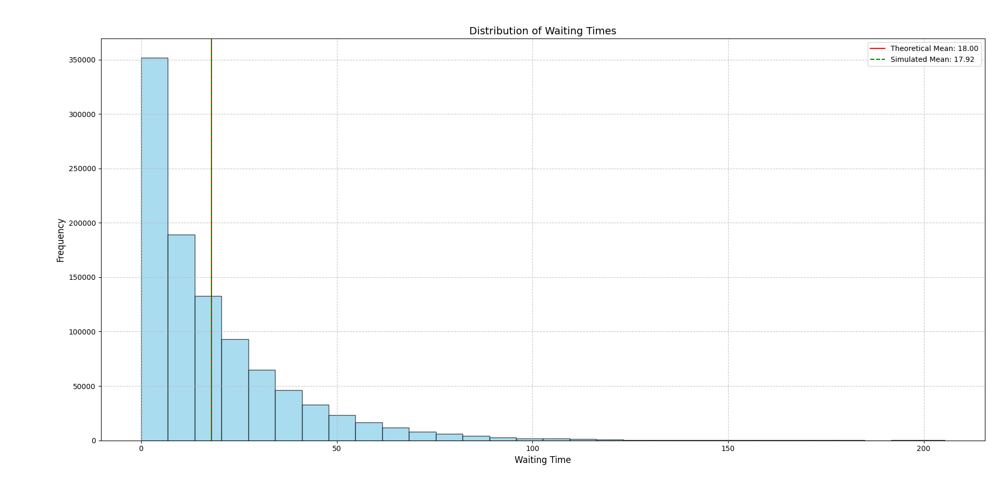

# 🔄 Markov Mavericks


**Markov Mavericks** is a comprehensive queueing theory simulation toolkit focusing on M/Er/1 queue systems. It provides robust tools for analyzing waiting time distributions, validating theoretical formulas, and verifying fundamental queueing theory principles like Little's Law through simulation and statistical analysis.

## 👤 Project Information

**Author**: Shreyas Mehta, Saksham Chitkara, Aditya Gaur, Aryan Chugh, Swam Singla, Hrishiraj
**Course**: Performance modeling of Computer Systems 
**Domain**: Performance Modeling & Operations Research


*Sample analysis of waiting time distribution in an M/Er/1 queueing system*

This project implements simulations and analytical methods to study fundamental properties of queueing systems, with particular focus on the waiting time distribution in M/Er/1 queues and verification of theoretical principles across different load parameters.

## 📋 Table of Contents

1. [👤 Project Information](#-project-information)
2. [📖 Introduction](#-introduction)
3. [✨ Features](#-features)
4. [🧮 M/Er/1 Queue Simulator](#-mer1-queue-simulator)
5. [📊 Waiting Time Distribution Analysis](#-waiting-time-distribution-analysis)
6. [⚖️ Little's Law Verification](#️-littles-law-verification)
7. [📈 Parametric Analysis](#-parametric-analysis)
8. [🏃‍♂️ Running the Simulations](#️-running-the-simulations)
9. [📝 Mathematical Background](#-mathematical-background)
10. [📊 Result Visualization](#-result-visualization)
11. [🧩 Code Structure](#-code-structure)
12. [📑 Reports and Documentation](#-reports-and-documentation)

## 📖 Introduction

This project implements comprehensive simulation and analysis tools for M/Er/1 queuing systems, which are Markovian arrival processes with Erlang service time distributions. The main components include:

- A detailed **M/Er/1 Queue Simulator** that tracks customers through the system
- **Waiting Time Distribution Analysis** to compare theoretical predictions with simulation results
- **Little's Law Verification** through multiple simulation techniques
- **Parametric Analysis** of queue behavior under varying load conditions

The codebase provides both analytical insights and visual representations to help understand the complex behaviors of queueing systems.

## ✨ Features

- **M/Er/1 Queue Simulation**
  - Complete customer journey tracking
  - Configurable arrival rates and service parameters
  - Warm-up period handling for steady-state analysis
  - Sample path generation and visualization
  
- **Statistical Analysis**
  - Empirical vs theoretical comparison
  - Multiple distribution fitting methods
  - Method-of-Moments estimation
  - AIC and goodness-of-fit metrics
  
- **Theoretical Validation**
  - Waiting time distribution formulation
  - Sojourn time analysis
  - Numerical root-finding for complex formulas
  - Analytical approximations
  
- **Little's Law Verification**
  - Multiple convergence methods
  - Time-series and sample path analysis
  - Multiple lambda parameter testing
  - Relative error calculation

## 🧮 M/Er/1 Queue Simulator

The M/Er/1 Queue Simulator is the core component that models the behavior of a queue with Poisson arrivals and Erlang-distributed service times.

### Core Implementation

The simulation is implemented in the `MErOneSimulation` class in `simulation.py`:

```python
class MErOneSimulation:
    """Simulation of an M/Er/1 queuing system."""
    
    def __init__(self, config: SimulationConfig):
        self.config = config
        self.customers: List[CustomerRecord] = []
        self.sample_path_times: List[float] = []
        self.sample_path_counts: List[int] = []
        
        # Set random seed if provided
        if config.random_seed is not None:
            np.random.seed(config.random_seed)
    
    def generate_service_time(self) -> float:
        """Generate service time as sum of r exponential phases."""
        return np.sum(np.random.exponential(1 / self.config.mu, size=self.config.r))
    
    def run(self) -> None:
        """Run the simulation."""
        # Implementation details...
```

### Theoretical Foundations

The M/Er/1 queue is characterized by:
- Poisson arrival process with rate λ
- Erlang-r service time distribution with rate μ per phase
- Single server system

The system utilization is calculated as ρ = λ * r / μ, and for stability, ρ < 1 is required.

### Tracking Customer Journey

The simulation tracks each customer's journey through:

```python
@dataclass
class CustomerRecord:
    """Record of a customer's journey through the system."""
    arrival_time: float = 0.0
    service_start_time: float = 0.0
    departure_time: float = 0.0
    
    @property
    def waiting_time(self) -> float:
        return self.service_start_time - self.arrival_time
    
    @property
    def sojourn_time(self) -> float:
        return self.departure_time - self.arrival_time
    
    @property
    def service_time(self) -> float:
        return self.departure_time - self.service_start_time
```

This allows detailed analysis of waiting times, sojourn times, and system behavior.

## 📊 Waiting Time Distribution Analysis

The waiting time distribution analysis module compares theoretical predictions with simulation results using advanced statistical techniques.

### Theoretical Waiting Time Formula

For M/Er/1 queues, the theoretical waiting time survival function is calculated as:

```python
def theoretical_waiting_time_survival(t, lambda_rate, r, mu):
    """
    Calculate the theoretical P(W > t) for M/Er/1 queue
    """
    rho = lambda_rate * r / mu
    
    if rho >= 1:
        raise ValueError("Utilization factor must be less than 1 for stability")
    
    # For numerical stability, find roots within (0,1)
    # using polynomial equation z^r - (lambda_rate/mu)(1-z) = 0
    
    # Implementation of root-finding and coefficient calculation...
    
    # Return approximation
    return rho * np.exp(-mu*(1-np.sqrt(rho))*t)
```

The implementation includes numerical methods to find polynomial roots for precise calculations.

### Distribution Fitting

The system fits multiple probability distributions to the simulated waiting times:

```python
def fit_waiting_time_distribution(waiting_times, lambda_rate, r, mu):
    """
    Fit a theoretical distribution to the waiting time data and 
    compare with M/Er/1 theoretical distribution
    """
    # Calculate theoretical mean and variance
    rho = lambda_rate * r / mu
    theo_mean = (rho / (1 - rho)) * ((r + 1) / (2 * mu))
    
    # Calculate empirical mean and variance
    empirical_mean = np.mean(waiting_times)
    empirical_var = np.var(waiting_times)
    
    # Distribution fitting and comparison...
```

Distributions tested include:
- Exponential
- Gamma
- Weibull
- Lognormal

Statistical metrics (AIC, BIC, KS test) are used to determine the best fit.

### Method of Moments Estimation

The code also implements Method of Moments (MoM) estimation for the Gamma distribution:

```python
def fit_waiting_time_distribution_mom(waiting_times, lambda_rate, r, mu):
    """
    Fit a gamma distribution to waiting time data using method-of-moments
    """
    empirical_mean = np.mean(waiting_times)
    empirical_var = np.var(waiting_times)
    
    # Method-of-moments gamma parameters
    gamma_shape = empirical_mean**2 / empirical_var
    gamma_scale = empirical_var / empirical_mean
    
    # Visualization and comparison...
```

This provides an alternative estimation approach that is compared with maximum likelihood estimation.

## ⚖️ Little's Law Verification

Little's Law (L = λW) is a fundamental principle in queueing theory that relates the average number of customers in the system (L) to the arrival rate (λ) and average time spent in the system (W).

### Implementation Approach

The project verifies Little's Law through multiple methods:

```python
def verify_littles_law(self, metrics: dict) -> None:
    """Verify Little's Law by calculating E[N]/E[T] and comparing to λ."""
    # Calculate the ratio E[N]/E[T]
    en_et_ratio = metrics['num_in_system'] / metrics['mean_sojourn_time']
    
    # The theoretical value is λ
    lambda_value = self.config.lambda_rate
    
    # Calculate the relative error
    rel_error = abs((en_et_ratio - lambda_value) / lambda_value) * 100
    
    print("\n=== Little's Law Verification ===")
    print(f"E[N]/E[T]: {en_et_ratio:.6f}")
    print(f"λ: {lambda_value:.6f}")
    print(f"Relative Error: {rel_error:.6f}%")
```

### Convergence Analysis

The project includes detailed convergence analysis:

```python
def plot_littles_law_convergence(self) -> None:
    """
    Plot E[N]/E[T] ratio versus number of jobs to visualize 
    the convergence of Little's Law as the simulation progresses.
    """
    # Skip warm-up period
    start_idx = self.config.warm_up_customers
    
    # Calculate E[N]/E[T] ratio for each point in time
    jobs = []
    ratios = []
    
    # Convergence calculation and visualization...
```

This provides insights into how quickly the system approaches the theoretical behavior and the stability of the convergence.

### Multi-parameter Testing

The system also tests Little's Law across multiple load parameters:

```python
def verify_littles_law_multiple_lambda(min_lambda=0.1, max_lambda=0.9, num_points=10, 
                                      r=3, mu=1.0, num_customers=100000, 
                                      warm_up_customers=10000, random_seed=42) -> None:
    """
    Verify Little's Law across multiple lambda values.
    """
    lambda_values = np.linspace(min_lambda, max_lambda, num_points)
    en_et_ratios = []
    
    # Test each lambda value and analyze results...
```

This verifies the law's validity across different system loads, from light traffic to near-capacity conditions.

## 📈 Parametric Analysis

The parametric analysis module examines how queue behavior changes with different system parameters.

### Effect of Load on Waiting Time

```python
def run_parametric_analysis():
    """
    Analyze how the waiting time distribution changes with different parameters
    """
    # Define parameter combinations to test
    scenarios = [
        {"lambda_rate": 0.2, "r": 2, "mu": 1.0, "label": "Light Load, r=2"},
        {"lambda_rate": 0.4, "r": 2, "mu": 1.0, "label": "Moderate Load, r=2"},
        {"lambda_rate": 0.6, "r": 2, "mu": 1.0, "label": "Heavy Load, r=2"},
        # Additional scenarios...
    ]
    
    # Analysis and visualization...
```

This shows how increasing system load (ρ) affects waiting time distributions.

### Effect of Service Distribution

The code also analyzes how different Erlang phase parameters (r) affect system behavior:

```python
# Second set of plots: Effect of Erlang phases (r) on waiting time distribution
plt.figure(figsize=(12, 6))

for i, scenario in enumerate(scenarios[3:]):
    # Parameters
    lambda_rate = scenario["lambda_rate"]
    r = scenario["r"]
    mu = scenario["mu"]
    
    # Calculate and plot theoretical metrics...
```

This provides insights into how service time variability impacts queue performance.

### Exact Formula Comparison

For special cases, the code compares approximations with exact formulas:

```python
def compare_with_exact_formula(lambda_rate=0.3, r=2, mu=1.0, num_points=1000):
    """
    Compare simulated waiting time distribution with the exact formula
    for specific simple cases where it can be calculated
    """
    # For M/M/1 (r=1), the exact formula is simple
    if r == 1:
        print("\nFor M/M/1 queue:")
        print(f"P(W > t) = ρ * exp(-μ*(1-ρ)*t)")
        
        # Exact formula implementation and comparison...
```

These comparisons validate the approximation methods used for more complex cases.

## 🏃‍♂️ Running the Simulations

The simulations can be run with various configurations:

### Basic M/Er/1 Simulation

```python
config, metrics = run_mer1_simulation(
    lambda_rate=0.3,  # Arrival rate
    r=3,              # Number of Erlang phases
    mu=1.0,           # Service rate per phase
    num_customers=100000,
    warm_up_customers=10000,
    random_seed=42,
    plot_sample_path=True,
    plot_histograms=True,
    verify_littles_law=True
)
```

This runs a standard simulation with visualization and verification.

### Multiple Load Scenarios

```python
# Heavy load scenario
config, metrics = run_mer1_simulation(
    lambda_rate=0.9,
    r=3,
    mu=1.0,
    num_customers=1000000,
    warm_up_customers=10000,
    random_seed=42
)

# Light load scenario
config, metrics = run_mer1_simulation(
    lambda_rate=0.2,
    r=4,
    mu=1.0,
    num_customers=1000000,
    warm_up_customers=10000,
    random_seed=42
)
```

These scenarios help analyze system behavior under different traffic conditions.

### Waiting Time Distribution Analysis

```python
waiting_times, config, best_dist = run_mer1_simulation_for_waiting_times(
    lambda_rate=0.3,
    r=3,
    mu=1.0,
    num_customers=100000,
    warm_up_customers=10000,
    random_seed=42
)

best_dist = fit_waiting_time_distribution_mom(
    waiting_times, 
    lambda_rate=0.3, 
    r=3, 
    mu=1.0
)
```

These functions focus on waiting time analysis with different fitting methods.

## 📝 Mathematical Background

### M/Er/1 Queue Basics

The M/Er/1 queue is characterized by:
- Poisson arrival process with rate λ
- Erlang-r service time distribution with parameter μ
- Single server with FIFO discipline

### Key Theoretical Formulas

- **System Utilization**: ρ = λr/μ
- **Mean Service Time**: E[S] = r/μ
- **Mean Waiting Time**: E[W] = (ρ/(1-ρ))((r+1)/(2μ))
- **Mean Sojourn Time**: E[T] = E[W] + E[S]
- **Mean Number in System**: E[N] = λE[T]

### Waiting Time Distribution

For the M/Er/1 queue, the waiting time survival function P(W > t) involves finding the roots of a polynomial equation and calculating appropriate coefficients. The project implements both:

1. **Exact Solution**: Using numerical methods to find polynomial roots
2. **Approximation**: Using the formula P(W > t) ≈ ρ * exp(-μ*(1-√ρ)*t)

### Little's Law

Little's Law states that L = λW, where:
- L is the average number of customers in the system
- λ is the arrival rate
- W is the average time spent in the system

The project verifies this law through multiple simulation techniques.

## 📊 Result Visualization

The project includes comprehensive visualization tools:

### Sample Path Visualization

```python
def plot_sample_path(self, max_time: Optional[float] = None) -> None:
    """Plot the sample path of number of customers in the system over time."""
    plt.figure(figsize=(12, 5))
    
    # Filter and plot sample path data
    # ...
    
    plt.step(times, counts, where='post', linewidth=1.5)
    plt.grid(True, linestyle='--', alpha=0.7)
    plt.xlabel('Time', fontsize=12)
    plt.ylabel('Number in System', fontsize=12)
    plt.title(f'Sample Path for M/E{self.config.r}/1 Queue (ρ = {self.config.rho:.2f})', fontsize=14)
    
    # Add theoretical and empirical means
    # ...
```

This shows the evolution of the number of customers in the system over time.

### Distribution Fitting Visualization

```python
def fit_distributions_to_waiting_times(waiting_times, lambda_rate, r, mu):
    """
    Fit multiple distributions to waiting time data and compare them.
    """
    # Visualization code for survival function
    plt.figure()
    plt.semilogy(t_values, p_empirical, 'b-', label='Simulation', marker='o', markevery=100)
    plt.semilogy(t_values, p_theoretical, 'r--', label='Theoretical Approximation')
    
    # Additional distribution fitting and visualization
    # ...
```

This compares empirical distributions with theoretical predictions and fitted models.

### Little's Law Convergence Plots

```python
def plot_littles_law_from_sample_path(self, min_jobs=1000) -> None:
    """
    Plot E[N]/E[T] ratio versus number of jobs processed, using the sample path
    to directly estimate E[N] at each point, giving a more accurate convergence plot.
    """
    # Convergence calculation and visualization
    # ...
    
    plt.figure(figsize=(12, 6))
    plt.plot(jobs, ratios, 'k-', linewidth=1.5, label='(E[T], E[N]) at a time instance')
    plt.axhline(y=self.config.lambda_rate, color='r', linestyle='--', alpha=0.7,
            label=f'Theoretical λ = {self.config.lambda_rate}')
    
    # Additional visualization elements
    # ...
```

These plots show how quickly the system converges to the theoretical behavior predicted by Little's Law.

## 🧩 Code Structure

### Core Files

- **simulation.py** – Complete M/Er/1 queue simulation implementation
- **waiting_time_dist.py** – Waiting time distribution analysis tools
- **parametric_analysis.py** – Parameter variation studies
- **temp.py** – Additional analysis techniques with improved visualization

### Key Classes

- **SimulationConfig** – Configuration for simulation parameters
- **CustomerRecord** – Tracks individual customer journey
- **MErOneSimulation** – Core simulation engine
- **Various distribution analysis functions** – Statistical testing and visualization tools

### Mathematical Components

- **Theoretical formulation** – Implementation of queueing theory formulas
- **Root-finding algorithms** – For solving polynomial equations
- **Distribution fitting** – Statistical analysis of simulation results
- **Little's Law verification** – Multiple validation approaches

This project combines theoretical queueing principles with modern statistical analysis and visualization techniques to provide deep insights into M/Er/1 queue behavior.

## 📑 Reports and Documentation

The project includes detailed documentation explaining the theoretical foundations and simulation results:

- [**Project Report**](Report_Markov_Mavericks.pdf): Comprehensive documentation of the project methodology, implementation details, and key findings
- [**Presentation Slides**](Presentation_Markov_Mavericks.pdf): Visual presentation of the project outcomes with graphical results and analysis
- [**Queueing Theory Reference**](queueing.pdf): Reference material on queueing theory principles relevant to this project

These documents provide in-depth explanations of:
- The theoretical underpinnings of M/Er/1 queues
- Detailed derivation of waiting time distribution formulas
- Statistical analysis of simulation results
- Verification techniques for Little's Law
- Comparative analysis of different parameter configurations
- Conclusions and recommendations for future work